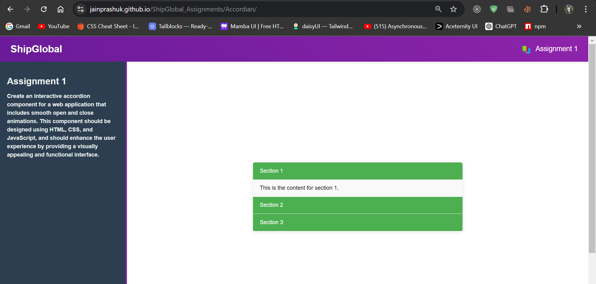
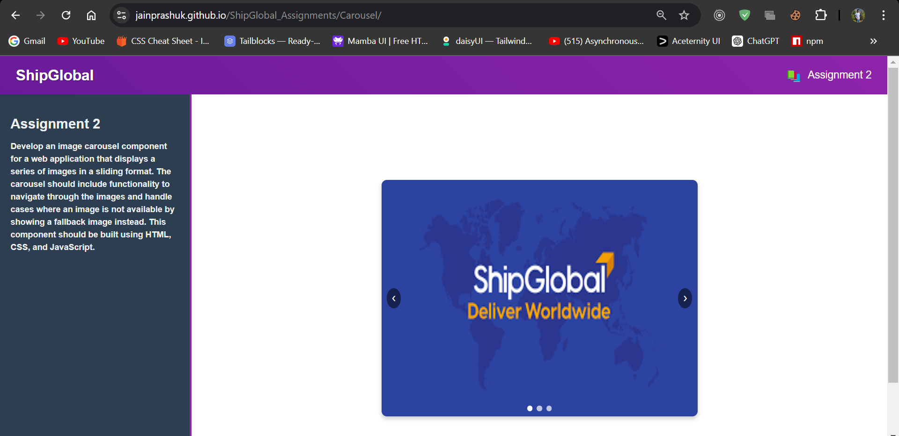
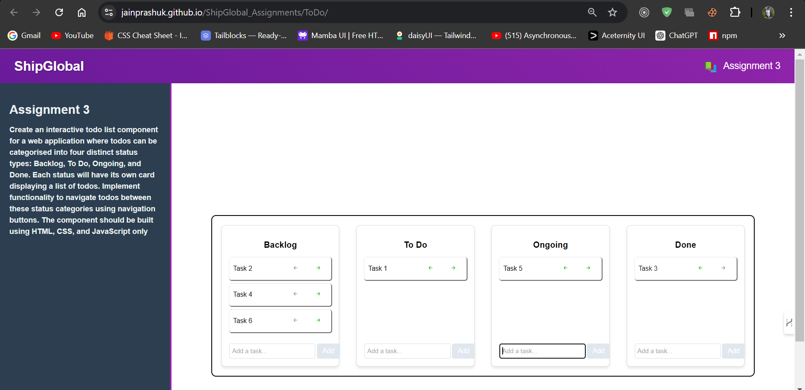
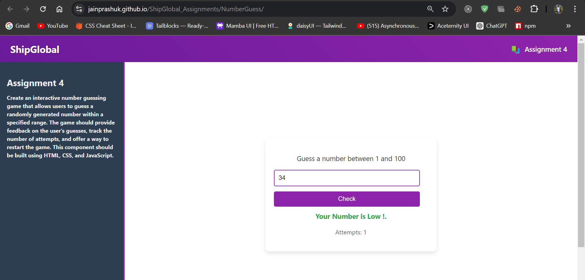
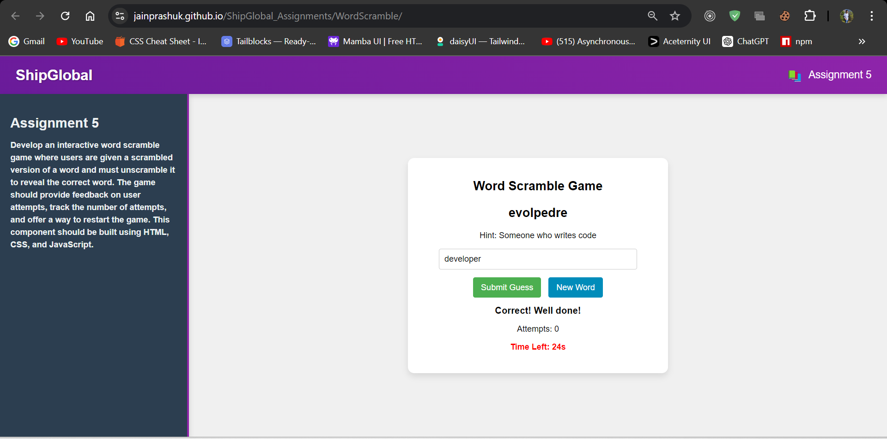

# SHIPGLOBAL Frontend Assessment

This repository contains solutions for the SHIPGLOBAL Frontend Assessment. The assessment consists of five distinct problems, each requiring the implementation of a specific frontend component using HTML, CSS, and JavaScript. Below you'll find a description of each problem, along with instructions for running the components.

## Accordion Component

**Objective**: Create an interactive accordion component with smooth open and close animations.

### Requirements
- Multiple sections with headers and content areas.
- Smooth animations for expanding and collapsing sections.
- Responsive design.
- Modern and clean styling.

### Files
- `index.html`
- `style.css`
- `script.js`

### Demo
https://jainprashuk.github.io/ShipGlobal_Assignments/Accordian/

## Carousel with Fallback Image

**Objective**: Develop an image carousel that handles image loading errors with a fallback image.

### Requirements
- Horizontal sliding format with navigation controls.
- Fallback image for failed image loads.
- Smooth transitions.
- Responsive design.

### Files
- `index.html`
- `style.css`
- `script.js`

### Demo
https://jainprashuk.github.io/ShipGlobal_Assignments/Carousel/

## Todo List with Status Navigation

**Objective**: Create a todo list with four status categories and navigation buttons to move todos between categories.

### Requirements
- Four status cards: Backlog, To Do, Ongoing, Done.
- Navigation buttons to move todos between statuses.
- Responsive design.

### Files
- `index.html`
- `style.css`
- `script.js`

### Demo
https://jainprashuk.github.io/ShipGlobal_Assignments/ToDo/

## Number Guessing Game

**Objective**: Create a number guessing game that tracks attempts and provides feedback.

### Requirements
- Random number generation.
- Input field for guesses.
- Feedback on guess accuracy.
- Attempt tracking and game restart functionality.
- Responsive design.

### Files
- `index.html`
- `style.css`
- `script.js`

### Demo
https://jainprashuk.github.io/ShipGlobal_Assignments/NumberGuess/

## Word Scramble Game

**Objective**: Develop a word scramble game where users unscramble a word and receive feedback.

### Requirements
- List of scrambled words with their correct versions.
- Input field for user guesses.
- Feedback on guess correctness.
- Attempt tracking and new word generation.
- Responsive design.

### Files
- `word_scramble.html`
- `word_scramble.css`
- `word_scramble.js`

### Demo
https://jainprashuk.github.io/ShipGlobal_Assignments/WordScramble/

## How to Run

1. Clone this repository:

    ```bash
    git clone https://github.com/Jainprashuk/ShipGlobal_Assignments
    ```

2. Navigate to the project directory:

    ```bash
    cd ShipGlobal_Assignments
    ```

3. Open the desired HTML file in your web browser to see the corresponding component.

## Sreenshots Of working Application







